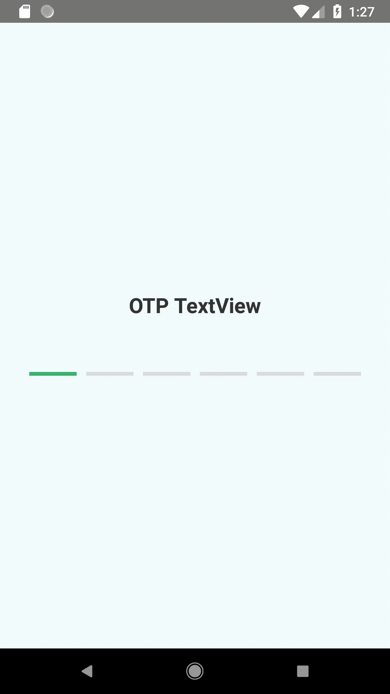

### REACT NATIVE OTP TEXT INPUT

[](https://nodei.co/npm/react-native-otp-textinput/)

[](https://badge.fury.io/js/react-native-otp-textinput)

Example Code:
```javascript
import OTPTextView from 'react-native-otp-textinput'

<OTPTextView 
    inputCount={5}
    textInputStyle={{width:40}}
    handleTextChange={(text)=>this.setState({otp:text})}
    />
 //conolse.log(this.state.otp) which gives
```
<br>

React Native Component that can used for OTPs and Pins as secure pin input.

#### Platform Support
Supports both Android and iOS.

#### Props

The following props are applicable for the component along with **props supported by react native text input component**

Prop              | Type     | Optional | Default     | Description
----------------- | -------- | -------- | ----------- | -----------
defaultValue         | string     | Yes       | ''       | Default Value that can be set based on OTP / Pin received from parent container.
handleTextChange         | func     | No       |  n/a      | callback with concated string of all cells as argument.
inputCount          | number      | Yes      | 4        | Number of Text Input Cells to be present.
tintColor          | string     | Yes      | #3CB371        | Color for Cell Border on being focused.
offTintColor       | string     | Yes      | #DCDCDC | Color for Cell Border Border not focused.
cellTextLength       | number     | Yes      | 1 | Number of character that can be entered inside a single cell.
containerStyle       | object     | Yes      | {} | style for overall container.
textInputStyle       | object     | Yes      | {} | style for text input.

### TO-DO
- [ ] Unit Testing
